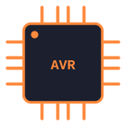
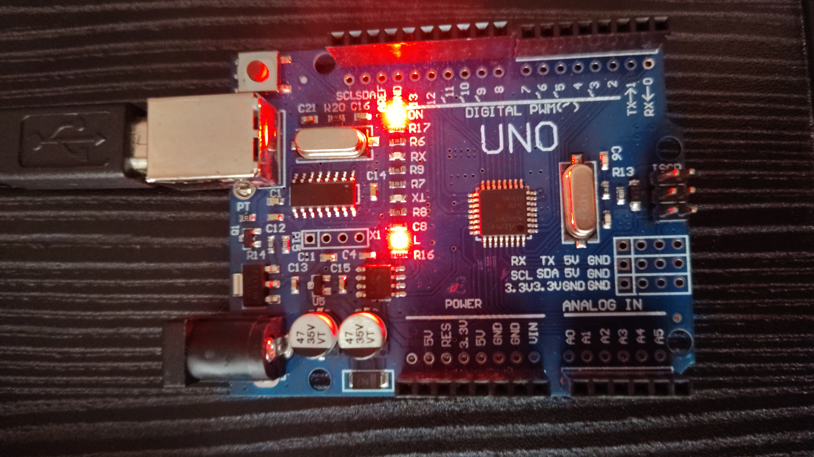
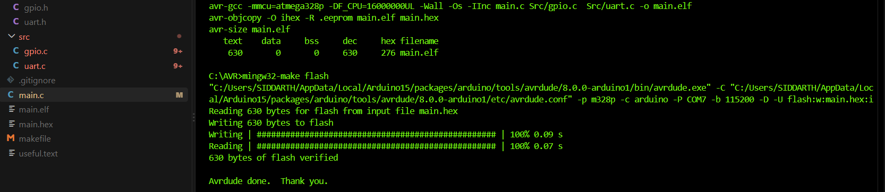
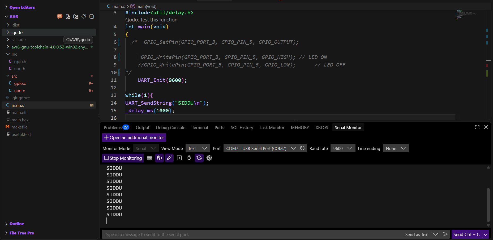

# Arduino Uno Bare-Metal Drivers

<br clear="left"/>


Register-level peripheral drivers for the **ATmega328P**, written in pure C with no Arduino core, no HAL, and no external libraries beyond `avr-libc`. The goal is direct control of hardware registers (`DDRx`, `PORTx`, `UCSRx`, `UBRRx`, `UDRx`) as a foundation for embedded systems work beyond the Arduino ecosystem.

## Table of Contents
- [Overview](#overview)
- [Demo](#demo)
- [Repository Structure](#repository-structure)
- [Hardware & Toolchain](#hardware--toolchain)
- [Building and Flashing](#building-and-flashing)
- [Usage Example](#usage-example)
- [API Reference](#api-reference)
- [Known Limitations](#known-limitations)
- [Roadmap](#roadmap)
- [License](#license)

## Overview

Two drivers are currently implemented:

- **GPIO** — configurable pin direction and digital I/O across `PORTB`, `PORTC`, and `PORTD`.
- **UART** — polling-based serial transmit over USART0 at a configurable baud rate.

`main.c` is a working demo: it configures `PB5` as an output and continuously transmits a string over UART once per second.

## Demo

**Board running the flashed firmware:**



**Build and flash via `make all` / `make flash`:**



**UART output in Serial Monitor (9600 baud), confirming `UART_SendString` works:**



## Repository Structure

```
AVR-Bare-Metal-Drivers/
├── Inc/
│   ├── gpio.h       # GPIO driver interface
│   └── uart.h       # UART driver interface
├── src/
│   ├── gpio.c       # GPIO driver implementation
│   └── uart.c       # UART driver implementation
├── main.c           # Demo application
├── makefile         # Build and flash automation
└── .vscode/         # Editor configuration
```

## Hardware & Toolchain

**Target:** ATmega328P @ 16 MHz (e.g. an Arduino Uno board used as bare-metal hardware, or a standalone chip)

| Tool | Purpose |
|---|---|
| `avr-gcc` | Cross-compiler for AVR |
| `avr-objcopy` | Converts the ELF output to Intel HEX |
| `avr-size` | Reports flash/RAM usage |
| `avrdude` | Flashes the HEX file to the MCU |
| `make` | Drives the build |

## Building and Flashing

```bash
make all      # builds main.elf and main.hex
make flash    # uploads main.hex via avrdude
make clean    # removes build artifacts
```

> **Before building:** open `makefile` and set `PORT` to your board's serial port, and check `AVRDUDE` / `AVRCONF`. These currently point at the avrdude copy bundled with the Arduino IDE on Windows (`COM7`) — on Linux/macOS you'll need to point them at your own avrdude install and serial device (e.g. `/dev/ttyUSB0`). Also note that `SRC` in the makefile references `Src/gpio.c` and `Src/uart.c`, while the folder in this repo is `src/` (lowercase) — this only builds silently on case-insensitive filesystems (Windows/macOS default); it will fail on a case-sensitive filesystem (most Linux setups) unless the casing is made consistent.

## Usage Example

```c
#include "gpio.h"
#include "uart.h"
#include <util/delay.h>

int main(void)
{
    GPIO_SetPin(GPIO_PORT_B, GPIO_PIN_5, GPIO_OUTPUT);
    UART_Init(9600);

    while (1) {
        UART_SendString("SIDDU\n");
        _delay_ms(1000);
    }
}
```

## API Reference

### GPIO — `Inc/gpio.h`

| Function | Description |
|---|---|
| `GPIO_SetPin(port, pin, mode)` | Sets pin direction: `GPIO_INPUT` or `GPIO_OUTPUT` |
| `GPIO_WritePin(port, pin, value)` | Drives a pin `GPIO_HIGH` or `GPIO_LOW` |
| `GPIO_TogglePin(port, pin)` | Toggles the current pin state |
| `GPIO_ReadPin(port, pin)` | ⚠️ Declared but not yet implemented (see [Known Limitations](#known-limitations)) |

Ports: `GPIO_PORT_B`, `GPIO_PORT_C`, `GPIO_PORT_D` — Pins: `GPIO_PIN_0` – `GPIO_PIN_7`

### UART — `Inc/uart.h`

| Function | Description |
|---|---|
| `UART_Init(baudrate)` | Configures USART0 for 8N1 at the given baud rate |
| `UART_SendChar(data)` | Blocking single-character transmit |
| `UART_SendString(str)` | Sends a null-terminated string |

## Known Limitations

- `GPIO_ReadPin()` has an empty body — it doesn't read or return anything yet.
- UART is transmit-only in practice: `UART_Init` enables the receiver, but no receive function exists.
- UART is polling-based (busy-wait on the `UDRE0` flag) — no interrupts, no buffering.
- The makefile's serial port and avrdude paths are hardcoded for a specific Windows setup.

## Roadmap

- [ ] Implement `GPIO_ReadPin`
- [ ] Interrupt-driven UART receive with a ring buffer
- [ ] Timer/PWM driver
- [ ] ADC driver
- [ ] I2C / SPI drivers

## License

This project is licensed under the [MIT License](LICENSE).

## Author

**Siddu** — [@SiddueXe](https://github.com/SiddueXe)
